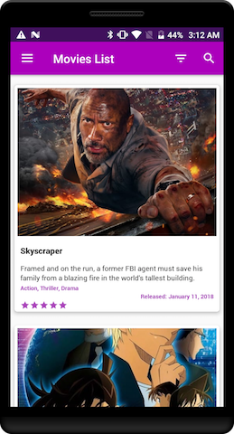
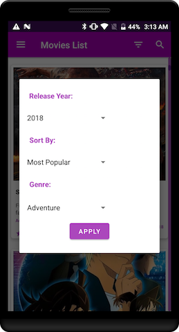
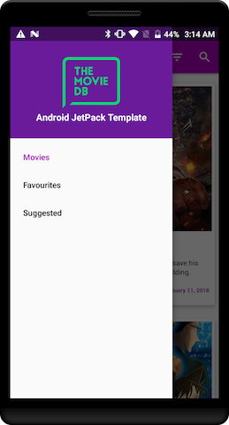

# AndroidJetpackTemplate
This is a template project with Android JetPack Implementation.

### Navigation + WorkManager+ Kotlin + Dagger 2 + Retrofit 2 + Realm + RxBus2  + ViewModel
##### `A simple android template with Android Jetpack`. 

A simple app to display list of Movies in RecyclerView using power of Android Jetpack. You can search, filter and bookmark movies. 
In this project work manager is implemented, which starts fetching similar movies based on your searches and shows them in 'Suggested' list.

* Jetpack Navigation is used
* Jetpack WorkManager is used
* Written in Kotlin
* API calls with Retrofit2
* Realm used for Database
* Dagger2 used for dependency injection with **dagger.android** approach
* [FlexibleAdapter](https://github.com/davideas/FlexibleAdapter) used for RecyclerView Adapter
* Pagging & Caching of list is implemented
* RxBus2 is used for event emit & listeners
* Android MVVM, Repository Pattern, Service Locator Pattern is used

### Prerequisite

This project requires an API key from [The Movie Database](https://www.google.com.ph/url?sa=t&rct=j&q=&esrc=s&source=web&cd=1&cad=rja&uact=8&ved=0ahUKEwiCtZOXnfrSAhXDNpQKHZShCg0QFggaMAA&url=https%3A%2F%2Fwww.themoviedb.org%2Fen&usg=AFQjCNFc2kOBuTnm_SAprWVGDgKKH4nJsA). Get your API key [here](https://www.themoviedb.org/account).
                
## MIT License

##### Copyright (c) 2018 Muhammad Umair Adil

Permission is hereby granted, free of charge, to any person obtaining a copy of this software and associated documentation files (the "Software"), to deal in the Software without restriction, including without limitation the rights to use, copy, modify, merge, publish, distribute, sublicense, and/or sell copies of the Software, and to permit persons to whom the Software is furnished to do so, subject to the following conditions:

The above copyright notice and this permission notice shall be included in all copies or substantial portions of the Software.

THE SOFTWARE IS PROVIDED "AS IS", WITHOUT WARRANTY OF ANY KIND, EXPRESS OR IMPLIED, INCLUDING BUT NOT LIMITED TO THE WARRANTIES OF MERCHANTABILITY, FITNESS FOR A PARTICULAR PURPOSE AND NONINFRINGEMENT. IN NO EVENT SHALL THE AUTHORS OR COPYRIGHT HOLDERS BE LIABLE FOR ANY CLAIM, DAMAGES OR OTHER LIABILITY, WHETHER IN AN ACTION OF CONTRACT, TORT OR OTHERWISE, ARISING FROM, OUT OF OR IN CONNECTION WITH THE SOFTWARE OR THE USE OR OTHER DEALINGS IN THE SOFTWARE.